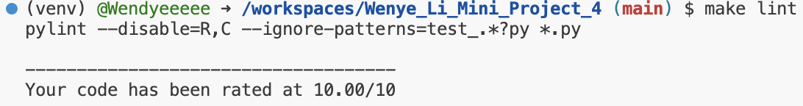
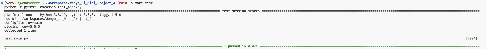

# Wenye Li Mini Project 1

This repo is for my work of creating a python project skeleton that contains functioning placeholders for key python project best-practice elements.

According to the requirement it contains:

* `.devcontainer`

* `Makefile`

* `GitHub Actions` 

* `Requirements.txt`

* `README.md`

## Installation，Format，Lint，and Test
- To install all the requirements in requirements.txt: run `make install` command

- To format code: run `make format` command

- To lint code: run `make lint` command

- To test code: run `make test` command

