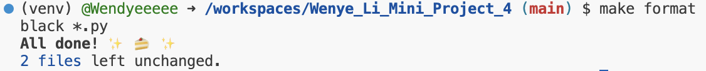

# Wenye Li Mini Project 4

This repo is for my work of setting up a Gitlab Actions workflow and testing across at least 3 different Python versions.

According to the requirement it contains:

- `.devcontainer`

- `GitHub Actions`

- `Makefile`

- `Requirements.txt`

- `README.md`

This repo also includes a main.py file with a function named `add_two_nums`. The function takes two number as input and returns their sum. Then I tested the function in test_main.py file.

## Installation，Format，Lint，and Test

- To install all the requirements in requirements.txt: run `make install` command

- To format code: run `make format` command

- To lint code: run `make lint` command

- To test code: run `make test` command

